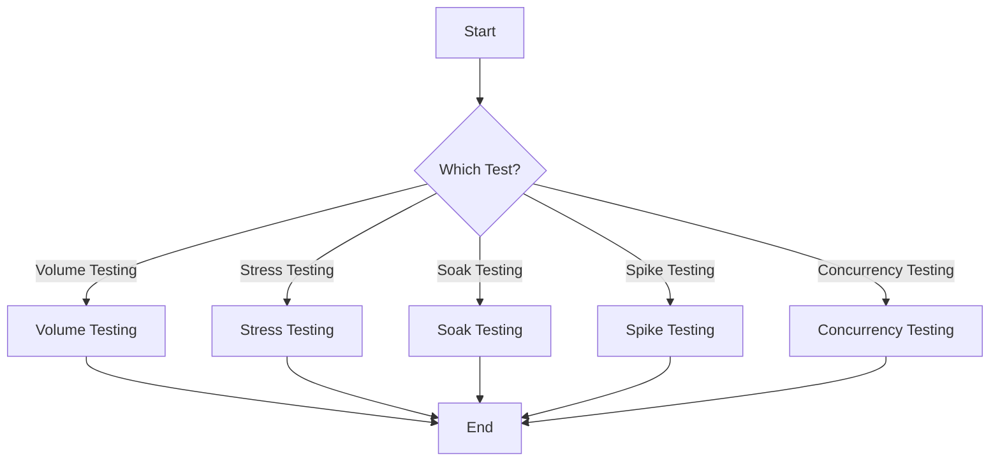

# Python Load Tester Library 🚀

Python Load Tester is a powerful, lightweight, and versatile load testing tool crafted specifically for web applications. Whether you want to simulate a horde of users hitting your website or stress test your endpoints, this tool is your companion.

 
> *Optional: Replace the link with an actual logo or banner for your project*

## Features 🌟

- **Volume Testing**: Measure the capacity of your system by simulating a large volume of requests.
- **Stress Testing**: Identify the breaking point of your infrastructure.
- **Soak Testing**: Ensure sustained performance by simulating extended loads.
- **Spike Testing**: Simulate sudden traffic bursts and see how your system copes.
- **Concurrency Testing**: Test for potential race conditions and see how your system performs with multiple simultaneous requests.

## Installation 📦

1. Clone the repository:
```
git clone https://github.com/your-username/python-load-tester.git
```
2. Navigate to the project directory:
```
cd python-load-tester
```
3. Install the required packages:
```
pip install -r requirements.txt
```

## Usage 🚀

```python
from load_tester import LoadTester

tester = LoadTester("http://example.com")
tester.stress_testing(threshold_time=2)
```
> *Replace the URL with your application's endpoint.*




## Contributing 🤝

Pull requests are welcome! For major changes, please open an issue first to discuss what you'd like to change.
